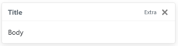
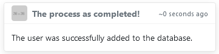

# Bootstrap-Toasty

Bootstrap-Toasty is a jQuery plugin for all your Toasty needs, with a simple call.

## Usage:

```javascript
    $.BToasty("Title", "Body", "Extra", "bottom_middle", true, 3000);
```


This is the normal way to use BToasty, with 5 simple parameters which are optional:
    - Title
    - Body
    - Extra (which is the little small text to the right of the title)
    - Position (which can be 6 different positions, more on that later)
    - Auto hide
    - Duration, before auto hiding

#### But there is more!
You can also run it with an object, which you can have more parameters for example:

```javascript
    $.BToasty({
        title: "The process as completed!",
        body: "The user was successfully added to the database.",
        extra: "time-auto",
        xbutton: false,
        position: "top_right",
        img: {src: "https://via.placeholder.com/26", alt: "Placeholder Image"},
    });
```

This will show a Toast in the top-right like this:


Now you might be wondering what is 'time-auto' in extra?

Well that is an extra feature that is active by default, it will update the seconds on the toast over time, so it will apear for example '~50 seconds ago' or '~2 minutes ago'.

